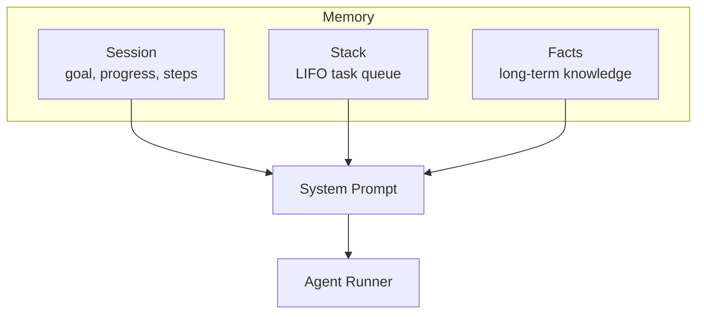

# Agent Memory Architecture

Three memory types for the LLM agent:

## Session Memory

Tracks current goal and progress. Cleared on completion.

| Field | Description |
|-------|-------------|
| `goal` | What the user asked for |
| `progress` | 0-100% |
| `completed` | Actions done |
| `current_step` | Current work |
| `next_steps` | Upcoming work |
| `blockers` | Issues |

## Stack Memory

LIFO todo queue. Persists across refresh.

| Field | Description |
|-------|-------------|
| `id` | Unique identifier |
| `description` | Task description |
| `priority` | high/medium/low |
| `context` | Optional data |

## Facts Memory

Long-term knowledge (up to 50 per workspace).

## Tools

### Session

| Tool | Parameters |
|------|------------|
| `set_goal` | `goal`, `steps?` |
| `update_progress` | `progress`, `completed_action?` |
| `complete_goal` | `summary` |

### Stack

| Tool | Parameters |
|------|------------|
| `push_task` | `description`, `priority?`, `context?` |
| `pop_task` | - |
| `peek_stack` | - |
| `clear_stack` | - |

### Facts

| Tool | Parameters |
|------|------------|
| `remember` | `message` |

## Storage Keys

| Type | Key |
|------|-----|
| Session | `nodus_agent_session_{workspaceId}` |
| Stack | `nodus_agent_stack_{workspaceId}` |
| Facts | `nodus_memories_{workspaceId}` |

## Files

- `src/llm/types.ts` - Type definitions
- `src/lib/storage.ts` - Storage functions
- `src/llm/tools/planningTools.ts` - Tool registrations
- `src/canvas/composables/agent/useLLMTools.ts` - Tool handlers
- `src/canvas/composables/agent/systemPrompt.ts` - Prompt builder
