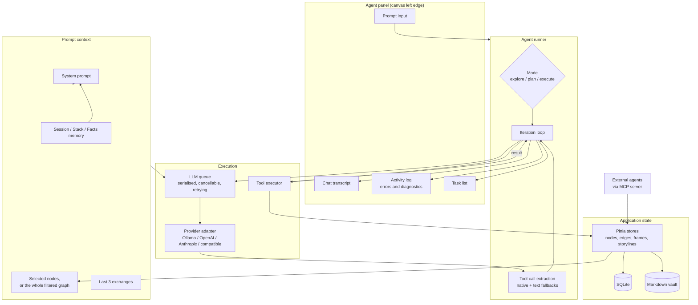
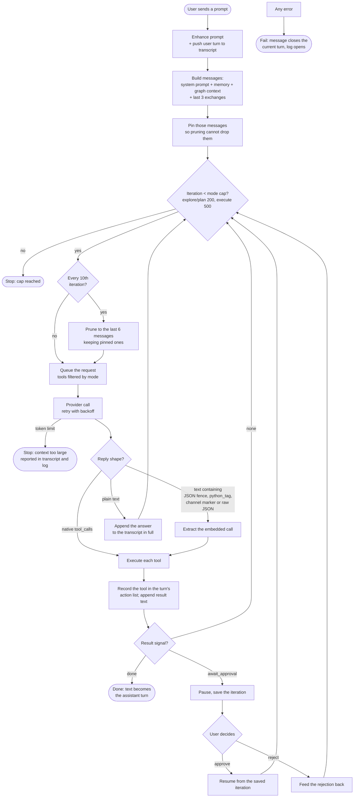
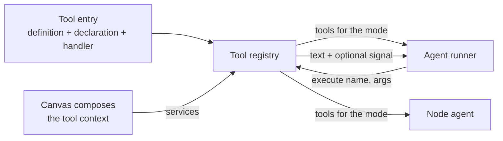
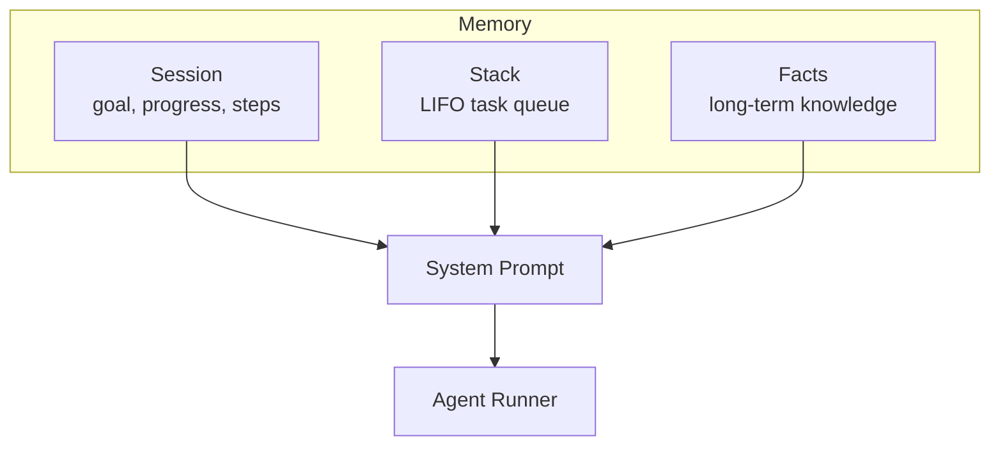

# Agent Architecture

Nodus runs an LLM agent against the graph. This page describes the system it
sits in, the loop it executes, and the three memories that feed its prompt.

## The agentic system

```mermaid
flowchart TB
    subgraph UI["Agent panel (canvas left edge)"]
        Prompt[Prompt input]
        Transcript[Chat transcript]
        Log[Activity log<br/>errors and diagnostics]
        Tasks[Task list]
    end

    subgraph Runner["Agent runner"]
        Mode{Mode<br/>explore / plan / execute}
        Loop[Iteration loop]
        Parse[Tool-call extraction<br/>native + text fallbacks]
    end

    subgraph Context["Prompt context"]
        Sys[System prompt]
        Mem[Session / Stack / Facts memory]
        Nodes[Selected nodes,<br/>or the whole filtered graph]
        Hist[Last 3 exchanges]
    end

    subgraph Exec["Execution"]
        Queue[LLM queue<br/>serialised, cancellable, retrying]
        Provider[Provider adapter<br/>Ollama / OpenAI / Anthropic / compatible]
        Tools[Tool executor]
    end

    subgraph State["Application state"]
        Stores[Pinia stores<br/>nodes, edges, frames, storylines]
        DB[(SQLite)]
        Files[(Markdown vault)]
    end

    Prompt --> Runner
    Mode --> Loop
    Context --> Queue
    Loop --> Queue
    Queue --> Provider
    Provider --> Parse
    Parse --> Loop
    Loop --> Tools
    Tools --> Stores
    Stores --> DB
    Stores --> Files
    Tools -->|result| Loop
    Loop --> Transcript
    Loop --> Log
    Loop --> Tasks
    Mem --> Sys
    Sys --> Context
    Stores --> Nodes

    MCP[External agents<br/>via MCP server] --> Stores
```

The same capabilities are reachable from both the in-app agent and the MCP
server; a gate test fails when one surface gains a tool, or a field of a
shared tool, that the other lacks.

## The execution loop

```mermaid
flowchart TB
    Start([User sends a prompt]) --> Enhance[Enhance prompt<br/>+ push user turn to transcript]
    Enhance --> Build[Build messages:<br/>system prompt + memory + graph context<br/>+ last 3 exchanges]
    Build --> Pin[Pin those messages<br/>so pruning cannot drop them]
    Pin --> Iter{Iteration < mode cap?<br/>explore/plan 200, execute 500}

    Iter -->|no| Stop([Stop: cap reached])
    Iter -->|yes| Prune{Every 10th<br/>iteration?}
    Prune -->|yes| DoPrune[Prune to the last 6 messages<br/>keeping pinned ones]
    Prune -->|no| Call
    DoPrune --> Call[Queue the request<br/>tools filtered by mode]

    Call --> Provider[Provider call<br/>retry with backoff]
    Provider -->|token limit| Limit([Stop: context too large<br/>reported in transcript and log])
    Provider --> Reply{Reply shape?}

    Reply -->|native tool_calls| Run[Execute each tool]
    Reply -->|text containing<br/>JSON fence, python_tag,<br/>channel marker or raw JSON| Extract[Extract the embedded call]
    Extract --> Run
    Reply -->|plain text| Say[Append the answer<br/>to the transcript in full]
    Say --> Iter

    Run --> Record[Record the tool in the turn's<br/>action list; append result text]
    Record --> Signal{Result signal?}

    Signal -->|done| Done([Done: text becomes<br/>the assistant turn])
    Signal -->|await_approval| Pause[Pause, save the iteration]
    Signal -->|none| Iter

    Pause --> Decide{User decides}
    Decide -->|approve| Resume[Resume from the saved iteration] --> Iter
    Decide -->|reject| Revise[Feed the rejection back] --> Iter

    Err[Any error] --> Fail([Fail: message closes the<br/>current turn, log opens])
```

### Loop details

| Concern | Behavior |
|---------|----------|
| Modes | `explore` (research and build), `plan` (read-only; design for approval), `execute` (carry out an approved plan). Each tool declares the modes that offer it, so a plan-mode run cannot write |
| Iteration cap | 200 for explore and plan, 500 for execute; reaching it stops the run rather than looping forever |
| Serialisation | Every model call goes through one queue, so concurrent runs cannot interleave writes; the queue is cancellable, which is what the stop button uses |
| Retry | Transient provider failures retry with backoff; a context-length error is not retried but reported, since repeating it cannot help |
| Context pruning | Every 10th iteration the message list is pruned to the last 6, keeping the pinned prompt and graph context |
| Tool-call fallbacks | Models without native tool calling emit calls inside text; the runner extracts them from JSON fences, `python_tag` and channel markers, or a bare JSON object |
| Generation guard | Each run increments a generation counter, so a late reply from a cancelled run cannot mutate the graph |
| Visible output | Answers land in the transcript in full; tool names collapse into a per-turn action list; errors open the log panel |

## Tool declaration

A tool is one registry entry: a definition the model sees, a declaration the application reads, and a handler that does the work. The rules and the defects behind them are in PRODUCT_DESIGN.md > One implementation per tool, Tool signals, and A tool declares its modes.

```mermaid
flowchart LR
    Def[Tool entry<br/>definition + declaration + handler] --> Reg[Tool registry]
    Reg -->|tools for the mode| Runner[Agent runner]
    Reg -->|tools for the mode| NodeAgent[Node agent]
    Compose[Canvas composes<br/>the tool context] -->|services| Reg
    Runner -->|execute name, args| Reg
    Reg -->|text + optional signal| Runner
```

### Declaration fields

| Field | Type | Meaning |
|-------|------|---------|
| `modes` | subset of `explore`, `plan`, `execute`, `node` | Modes whose request offers the tool. `node` is the per-node agent |
| `mutates` | boolean | The tool changes nodes, edges, frames, storylines or themes. Incompatible with `plan` |
| `requires` | list of service names | Context services the handler uses |
| `unexposedReason` | string | Required when `modes` is empty; states why the tool is registered but not offered |

### Context services

The tool context always carries the node store, the log, and coordinate helpers. Everything else is an optional service injected by the canvas; a handler whose service is absent reports the capability as unavailable.

| Service | Supplies | Used by |
|---------|----------|---------|
| `llm` | A model call through the LLM queue, with cancellation | `smart_move`, `smart_connect`, `smart_color`, `color_matching`, `for_each_node`, `research_topic`, `create_theme`, `update_theme`, `format_math` |
| `search` | Web search, URL fetch, Wikipedia search and fetch, quick and deep research, claim validation | `web_search`, `fetch_url`, `research`, `deep_research`, `wikipedia_search`, `fetch_wikipedia`, `validate_claim`, `build_knowledge_base`, `expand_aspect` |
| `themes` | The themes store | Theme tools |
| `plan` | Plan state and the task list the panel shows | `create_plan`, `request_approval`, `plan`, `update_task` |
| `memory` | Facts, session and stack storage for the current workspace | `remember` and the unexposed session and stack tools |
| `nodeDraft` | The content and title of the note the node agent is editing, and whether the run has saved | Node-edit tools |
| `layout` | Force layout | `auto_layout` |

Completeness assessment is a pure function of its inputs, so `check_completeness` and `check_progress` call it directly and require no service.

### Handler result

A handler returns text, or `{ text, signal }`. `text` is the tool result the model receives. `signal` is one of `done`, `await_approval`, `node_done`, and is acted on by the runner; it is never part of the text.

## The three memories

The system prompt is assembled from three memories with different lifetimes.

```mermaid
flowchart TB
    subgraph Memory
        Session[Session<br/>goal, progress, steps]
        Stack[Stack<br/>LIFO task queue]
        Facts[Facts<br/>long-term knowledge]
    end

    Session --> SP[System Prompt]
    Stack --> SP
    Facts --> SP
    SP --> Agent[Agent Runner]
```

## Session Memory

Tracks current goal and progress. Cleared on completion.

| Field | Description |
|-------|-------------|
| `goal` | What the user asked for |
| `progress` | 0-100% |
| `completed` | Actions done |
| `current_step` | Current work |
| `next_steps` | Upcoming work |
| `blockers` | Issues |

## Stack Memory

LIFO todo queue. Persists across refresh.

| Field | Description |
|-------|-------------|
| `id` | Unique identifier |
| `description` | Task description |
| `priority` | high/medium/low |
| `context` | Optional data |

## Facts Memory

Long-term knowledge (up to 50 per workspace).

## Tools

### Session

| Tool | Parameters |
|------|------------|
| `set_goal` | `goal`, `steps?` |
| `update_progress` | `progress`, `completed_action?` |
| `complete_goal` | `summary` |

### Stack

| Tool | Parameters |
|------|------------|
| `push_task` | `description`, `priority?`, `context?` |
| `pop_task` | - |
| `peek_stack` | - |
| `clear_stack` | - |

### Facts

| Tool | Parameters |
|------|------------|
| `remember` | `message` |

## Storage Keys

| Type | Key |
|------|-----|
| Session | `nodus_agent_session_{workspaceId}` |
| Stack | `nodus_agent_stack_{workspaceId}` |
| Facts | `nodus_memories_{workspaceId}` |

## Files

- `src/llm/registry.ts` - Tool registry, declaration and context types
- `src/llm/tools/` - Tool entries, one file per domain
- `src/llm/agentModes.ts` - Mode prompts and iteration caps
- `src/llm/types.ts` - Memory and plan types
- `src/lib/storage.ts` - Storage functions
- `src/canvas/composables/agent/agentToolContext.ts` - Composes the tool context and its services
- `src/canvas/composables/agent/useAgentRunner.ts` - Execution loop
- `src/canvas/composables/agent/useNodeAgent.ts` - Per-node agent loop
- `src/canvas/composables/agent/systemPrompt.ts` - Prompt builder
