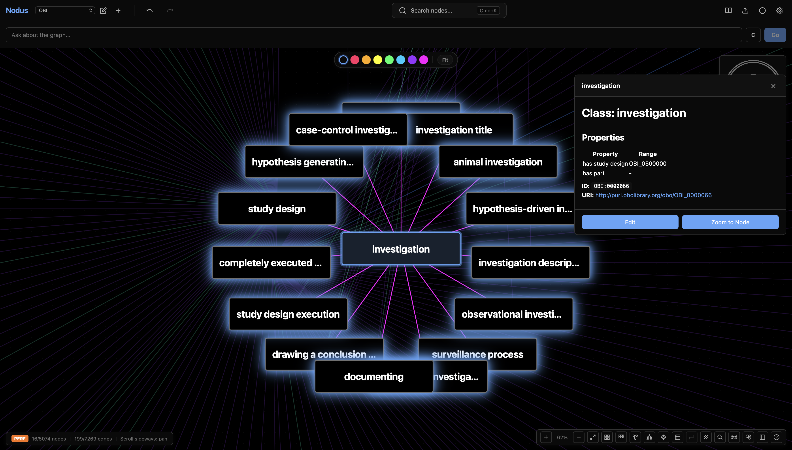
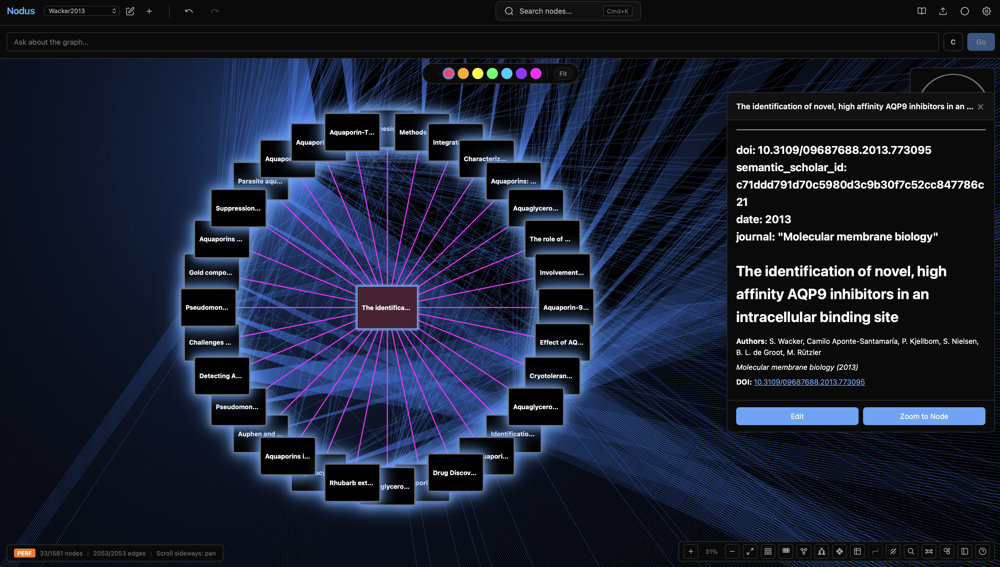
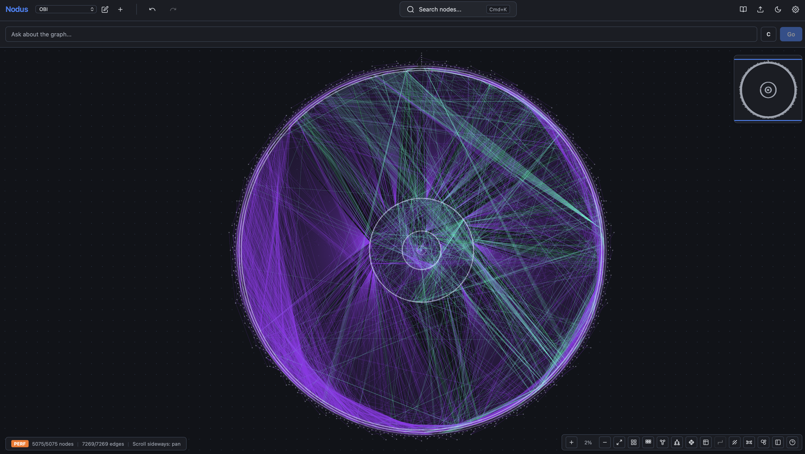
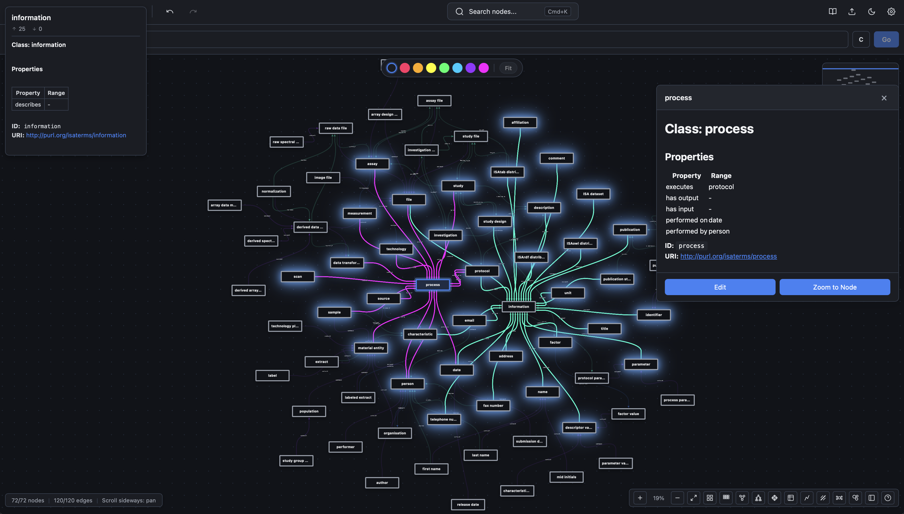
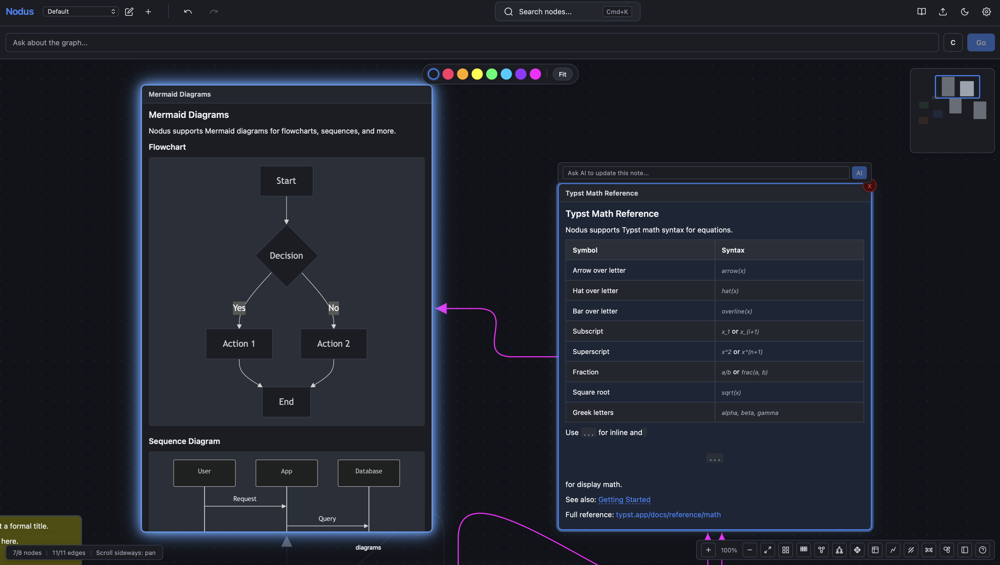
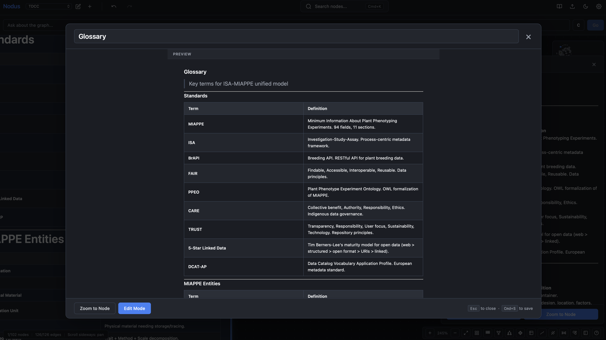
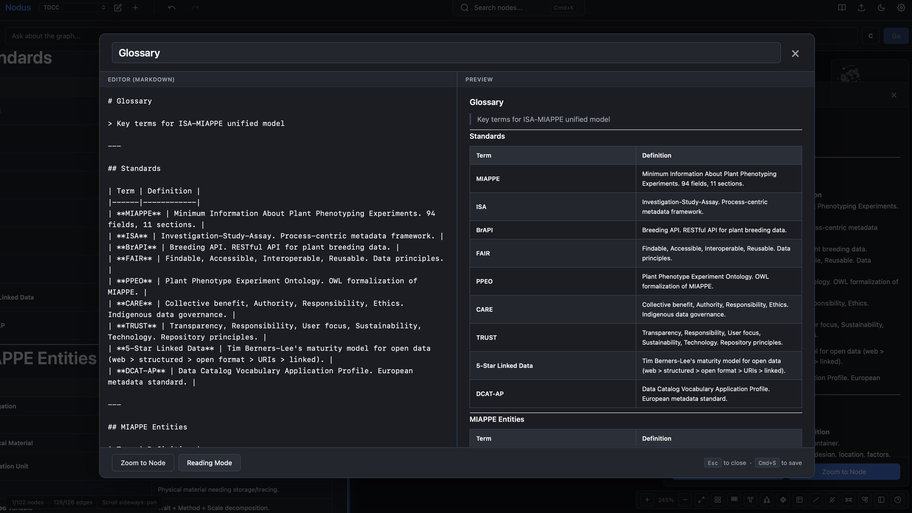

<header class="chart-hero">
  

    
Local-first knowledge cartography

    <h1 class="wordmark">Nod<em>us</em></h1>
    
The document and the whiteboard are the same surface. Draw your thinking as a graph, and keep every file on your own machine.

    

      <a class="act" href="downloads/">Download</a>
      <a class="act act--ghost" href="https://github.com/sorenwacker/nodus">Source</a>
    

  

  <aside class="titleblock">
    <dl>
      <dt>Platforms</dt><dd>macOS / Windows / Linux</dd>
      <dt>Storage</dt><dd>Markdown + SQLite</dd>
      <dt>Models</dt><dd>Ollama or cloud</dd>
      <dt>Licence</dt><dd>Open source</dd>
      <dt>Network</dt><dd>Optional</dd>
    </dl>
    <svg class="constellation" viewBox="0 0 320 120" role="img" aria-label="A small constellation of connected nodes">
      <line class="edge" x1="26" y1="88" x2="88" y2="46" />
      <line class="edge" x1="88" y1="46" x2="152" y2="70" />
      <line class="edge" x1="152" y1="70" x2="214" y2="30" />
      <line class="edge" x1="214" y1="30" x2="292" y2="62" />
      <line class="edge" x1="88" y1="46" x2="120" y2="18" />
      <line class="edge" x1="152" y1="70" x2="176" y2="104" />
      <circle class="node" cx="26" cy="88" r="3" />
      <circle class="node" cx="120" cy="18" r="2.5" />
      <circle class="node" cx="176" cy="104" r="2.5" />
      <circle class="node" cx="292" cy="62" r="3" />
      <circle class="node node--lit" cx="88" cy="46" r="3.5" />
      <circle class="node node--lit pulse" cx="152" cy="70" r="4" />
      <circle class="node" cx="214" cy="30" r="3" />
    </svg>
  </aside>
</header>

Capabilities

<section class="index">
  <article class="entry">
    
01

    

      <h3>Single canvas</h3>
      
The document and the whiteboard are one thing. No embeds, no context switching. Connect ideas visually with arrows and typed relationships.

    

  </article>
  <article class="entry">
    
02

    

      <h3>Native Typst maths</h3>
      
Sub-second rendering with modern Typst syntax. Write equations naturally, without waiting on a LaTeX toolchain.

    

  </article>
  <article class="entry">
    
03

    

      <h3>Obsidian bridge</h3>
      
Bi-directional sync with your vault. Your markdown files stay exactly as they are, so both tools keep working.

    

  </article>
  <article class="entry">
    
04

    

      <h3>Local-first</h3>
      
Your data never leaves the device unless you choose to move it. No cloud account, and the whole application works offline.

    

  </article>
  <article class="entry">
    
05

    

      <h3>Model integration</h3>
      
Run local models through Ollama or connect a cloud provider. The agent organises, connects and researches inside the graph you already have.

    

  </article>
  <article class="entry">
    
06

    

      <h3>Export anywhere</h3>
      
PDF, Typst source or plain Markdown. Nothing is locked in, because the files were yours to begin with.

    

  </article>
</section>

Plates

<section class="plates">
  <figure><figcaption>Fig. 01 - Canvas</figcaption></figure>
  <figure><figcaption>Fig. 02 - Graph</figcaption></figure>
  <figure><figcaption>Fig. 03 - Connections</figcaption></figure>
  <figure><figcaption>Fig. 04 - Editing</figcaption></figure>
  <figure><figcaption>Fig. 05 - Themes</figcaption></figure>
  <figure><figcaption>Fig. 06 - Layout</figcaption></figure>
  <figure><figcaption>Fig. 07 - Overview</figcaption></figure>
</section>

<section class="closing">
  

    <h2>Start mapping</h2>
    
Free and open source, for macOS, Windows and Linux.

  

  <a class="act" href="downloads/">Download Nodus</a>
</section>

<section class="colophon">
  
<strong>Disclaimer:</strong> this software is provided as-is, without warranty. The author is not liable for data loss, API costs or other damages.

</section>

